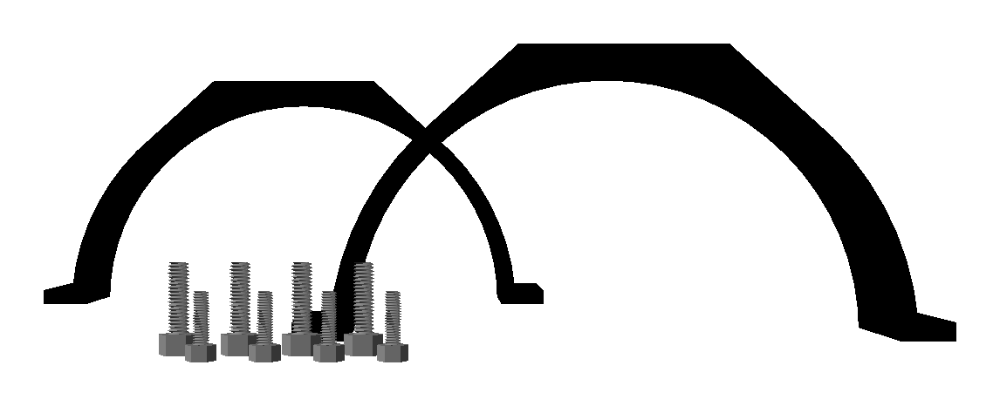

# Parametric Model of Blue Robotics Enclosure Clamp

This repository contains a parametric OpenSCAD model for the [Blue Robotics Enclosure Clamp][store] used with their line of Watertight Enclosures.

This model is based on the CAD models released by Blue Robotics and available on the [product page][store] and as a [3D printable model][printable], licensed [CC BY 4.0][license].

## Usage

Clone this repository with submodules:

    git submodule init --update

Use OpenSCAD to render one of the files `enclosure-clamp-{...}.scad`. Export the rendering as an STL file and 3D print.

## Variant Notes

### 2" (50mm) series

The official 2" series clamp is of slightly different design than the 3" and 4" series, featuring a wider 4.5mm diameter hole on one flange, and more fillets. These features are not reproduced on this model.

  * 4 x M4x10 socket head cap screws, for flanges and base
  * 2 x adhesive rubber strip (details TBD)

### 3" (75mm) and 4" (100mm) series

  * 4 x M3x12 socket head cap screws, for flanges
  * 4 x M4x14 socket head cap screws, for base
  * 2 x adhesive rubber strips (acrylic tube: 1/16", aluminum: 1/8")

### 6" and 8" series

There is no first-party enclosure clamp for the 6" and 8" enclosure series. The design file for the 6" series uses dimensions derived from the 4" series. This is a good starting point for other enclosure diameters.

Mounting hardware is the same as for the 3" and 4" series.

[license]: https://creativecommons.org/licenses/by/4.0/
[printable]: https://www.printables.com/model/397769-watertight-enclosure-clamps
[store]: https://bluerobotics.com/store/watertight-enclosures/enclosure-clamp/
